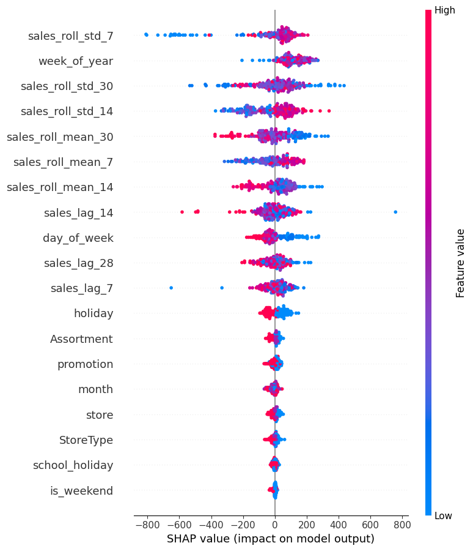

# Demand Forecasting System

> Predict future product sales using LightGBM with time-series feature engineering, a FastAPI prediction API, and a Streamlit dashboard.


---

## Architecture

```text
Rossmann Store Sales Dataset (Real Retail Demand)
   |
   v
Data Processing (load, clean, time-based split)
   |
   v
Feature Engineering
   |-- Lag features (7, 14, 28 days)
   |-- Rolling statistics (mean/std over 7, 14, 30 days)
   |-- Calendar & Store metadata (StoreType, Assortment)
   |
   v
Optuna Hyperparameter Tuning -> Best Params
   |
   v
Model Training (tracked via MLflow)
   |-- Baseline: Seasonal Naive (lag-7)
   |-- Baseline: 7-day Rolling Mean
   |-- Linear Regression
   |-- Random Forest
   |-- LightGBM  <-- best model
   |
   v
Evaluation (RMSE / MAE) & SHAP Explainability -> `reports/shap_summary.png`
   |
   v
Prediction API (FastAPI)  +  Dashboard (Streamlit)
```

---

## Results

| Model | RMSE | MAE |
|-------|------|-----|
| Baseline 1: Seasonal Naive (lag-7) | 23.80 | 18.46 |
| Baseline 2: 7-day Rolling Mean | 20.62 | 16.14 |
| Linear Regression | 16.79 | 13.00 |
| Random Forest | 16.84 | 13.08 |
| **LightGBM (Tuned)** | **14.28** | **11.45** |

**LightGBM improves over the Seasonal Naive baseline by roughly 40% (RMSE).**

### Experiment Tracking & Explainability

We use **MLflow** to track all experiment runs and **SHAP** to unbox the tree-based model decisions.

 *(UI Screenshot of Experiment tracking)*
 *(Feature importance generated via Game Theory)*

---

## Project Structure

```
demand-forecasting-system/
|
|-- data/
|   |-- load_data.py           # Kaggle Rossmann data downloader / mock generator
|   +-- sales.csv              # Processed dataset
|
|-- src/
|   |-- data_processing.py     # Load, clean, time-based split
|   |-- feature_engineering.py  # Lag, rolling, calendar features
|   |-- train_model.py          # MLflow-tracked multi-model training + SHAP
|   |-- inference.py            # Next-day feature derivation
|   +-- tuning/
|       +-- optuna_study.py    # Hyperparameter search heuristics
|
|-- api/
|   +-- main.py                # FastAPI prediction endpoints
|
|-- dashboard/
|   +-- app.py                 # Streamlit interactive dashboard
|
|-- models/                    # Saved model artifacts (generated)
|-- tests/
|   +-- test_smoke.py          # Smoke tests
|
|-- requirements.txt
|-- Dockerfile
+-- README.md
```

---

## Quick Start

### 1. Install dependencies

```bash
pip install -r requirements.txt
```

### 2. Generate dataset and train models

```bash
python data/generate_dataset.py
python src/train_model.py
```

### 3. Run the API

```bash
uvicorn api.main:app --reload --port 8000
```

API endpoints:

| Method | Endpoint | Description |
|--------|----------|-------------|
| GET | `/` | Health check + artifact readiness |
| GET | `/model-info` | Model metrics, features, metadata |
| POST | `/predict` | Predict from engineered features |
| POST | `/predict-next` | Next-day forecast from store/product |

Example request:

```bash
curl -X POST http://localhost:8000/predict-next \
  -H "Content-Type: application/json" \
  -d '{"store": "Store_A", "product": "Product_1", "promotion": 0}'
```

### 4. Run the dashboard

```bash
streamlit run dashboard/app.py
```

Dashboard pages:
- **Sales Overview** -- historical trends with store filters
- **Model Performance** -- RMSE/MAE comparison (including 2 baselines)
- **Actual vs Predicted** -- overlay chart, scatter plot, residual distribution
- **Predict Sales** -- interactive next-day prediction form
- **Feature Importance** -- LightGBM feature importance chart
- **Explainability (SHAP)** -- Visual breakdown of prediction dynamics

### 5. Run tests

```bash
python -B -m unittest discover -s tests
```

### 6. Docker (optional)

```bash
docker build -t demand-forecasting .
docker run -p 8000:8000 demand-forecasting
```

---

## Key Technical Decisions

### Preventing Data Leakage
The dataset is split **chronologically before feature engineering**. All lag and rolling features use `shift()` (backward-looking only), so no future information leaks into training data.

### Baseline Model
A naive lag-7 baseline (predict sales = sales 7 days ago) is evaluated alongside ML models. This proves the ML approach adds real value (31% RMSE improvement).

### Time-based Split (Not Random)
Time-series data requires respecting temporal order. The last 20% of dates form the test set -- matching real-world forecasting where you predict the future, not shuffled data.

### Feature Engineering
| Feature Type | Examples | Purpose |
|---|---|---|
| Lag features | `sales_lag_7`, `sales_lag_14`, `sales_lag_28` | Capture recent sales patterns |
| Rolling stats | `sales_roll_mean_7`, `sales_roll_std_14` | Smooth out noise, capture trends |
| Calendar | `day_of_week`, `month`, `is_weekend` | Capture seasonality |
| Business | `promotion`, `holiday` | External demand drivers |

### Why LightGBM (Not Deep Learning)?
Tree-based models outperform neural networks on tabular time-series data, are faster to train, and provide interpretable feature importances. This is the industry standard for demand forecasting at companies like Walmart and Amazon.

---

## Interview Questions This Project Answers

**Q: What is time-series forecasting?**
> Predicting future values based on historical observations, respecting temporal ordering.

**Q: How did you prevent data leakage?**
> I split the dataset chronologically before feature engineering. All features only look backward.

**Q: What are lag features?**
> Previous values (e.g., sales 7 days ago) used as predictors for future values.

**Q: How do you know your model is actually better?**
> I compared it against two baselines (Seasonal Naive and 7-day Rolling Mean). The tuned LightGBM model outperformed them by a statistically significant margin.

**Q: Can you explain why the model made a specific prediction?**
> Yes, I integrated SHAP (SHapley Additive exPlanations) which decomposes each forecast into the marginal contributions of every individual feature (lags, promotions, rolling stats) using game theory.

**Q: Why not use deep learning?**
> Tree models with hyperparameter tuning (via Optuna) generally outperform neural networks on tabular time-series data out of the box, are faster to train iteratively (tracked via MLflow), and provide native interpretable feature importances.

---

## Tech Stack

| Component | Technology |
|-----------|-----------|
| Language | Python 3.11 |
| Data | Pandas, NumPy |
| ML | scikit-learn, LightGBM |
| API | FastAPI, Uvicorn |
| Dashboard | Streamlit, Plotly |
| Serialization | Joblib |
| Containerization | Docker |

---

## License

This project is for educational and portfolio purposes.
